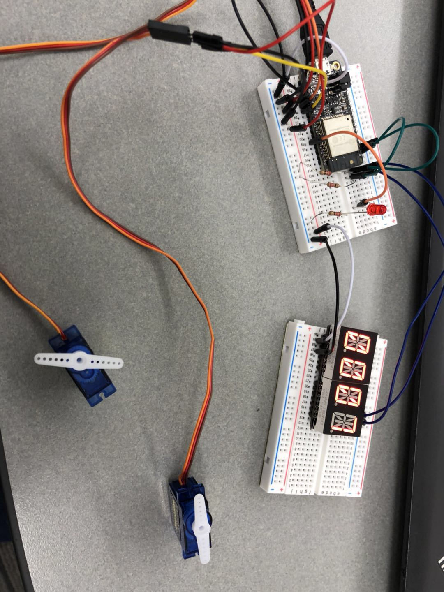
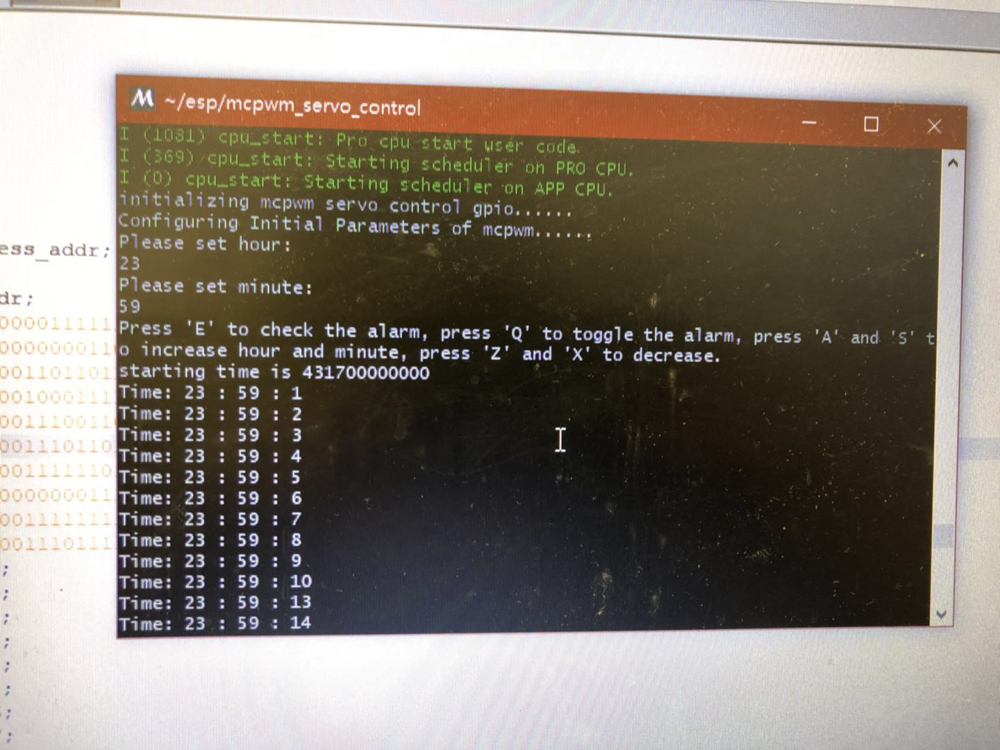
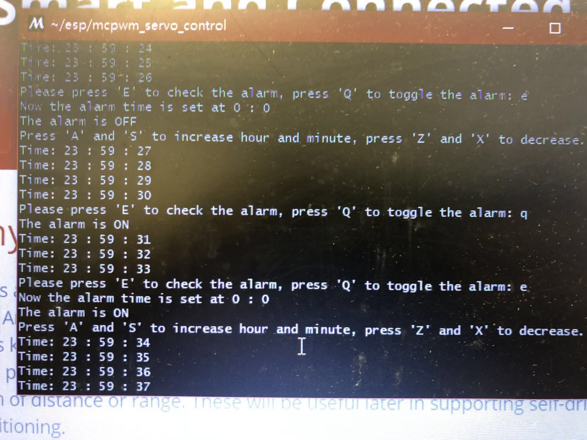

#	Quest 1 Report

Authors: Wuliang Cheng, Qinglong Yu, Cong Han, 2018-09-01

##	Summary

In this quest we built a pseudo-mechanical alarm clock on ESP32 board including two servos indicating minute and second, an i2c display indicating 
hour and minute, and a LED that works as a "alarm" and blinks at the set time.

##	Evaluation Criteria

There are following functions on our alarm:

	- Able to set the current time in console when we start the alarm.
	- Able to set the alarm time and toggle the alarm on and off at anytime using the console.
	- LED will blink (switch state with interval of 1s) for 1 minute when we arrive at the alarm time. 
	We can also turn it off if we want.

##	Solution Design

Pins mapping:

	- Vcc, GND, A0 for servo 1(min)
	- Vcc, GNC, A1 for servo 2(sec)
	- Vcc, GND, Pin18(MO), and a resistor for LED
	- Vcc, GND, Pin22, Pin23, and two resistors for the i2c board

##	Sketches and Photos
1. Our servos, i2c display, and wiring

2. Console control(starting the clock and setting the initial time)

3. Console control(setting the alarm time and turning on the alarm)

##	Modules, Tools, Source Used in Solution
Our source code is at [./mcpwm_servo_control/main/mcpwm_servo_control_example.c](./mcpwm_servo_control/main/mcpwm_servo_control_example.c).
We adopted some codes from the esp code example library, including mcpwm_servo_control, uart_echo, timer_group, and i2c.

##	Supporting Artifacts

[Here](https://drive.google.com/open?id=1ax-Gqkh_ca_4Z3otq-um5qZNvTNiPWZr) is a demo video of our quest. We set the starting time at 23:59 and 
then set the alarm on at 00:00.