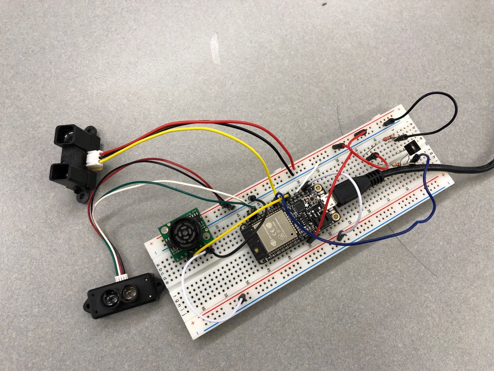
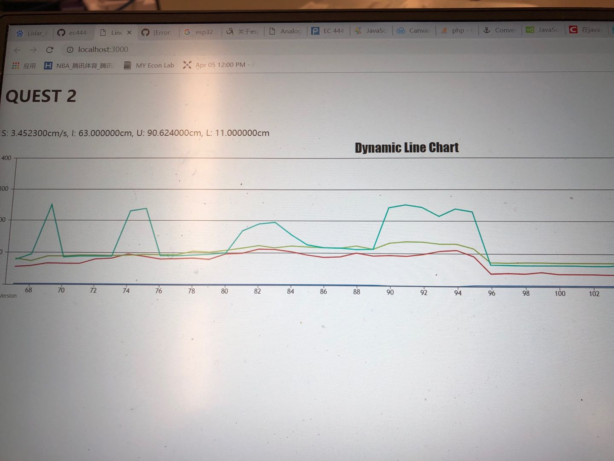

#	Quest 1 Report

Authors: Wuliang Cheng, Qinglong Yu, Cong Han, 2018-09-01

##	Summary

In this quest we provide data collection on the variety of sensing devices includes untrasonic sensor, lidar, IR sensor, and wheel speed sensor, which all measure some form of distance or range, and then plot the captured data in a useful way.
We tract the data from the monitor and then use charts.js and node.js to plot a multi-series dynamic line chart.

##	Evaluation Criteria

	- Develop formulae to convert measured units into common engineering units among the sensors
	- Write a program to service each sensor at regular intervals to produce a real-time strip-chart display function.
	- Transfer data to a host computer for plotting by Direct to a plotting program
	- Demonstrate your solution
	- Write up a description of how you built your solution. Include concepts, modules, APIs, tools, etc.
	- Submit a < 90s video of your report. Everyone must be on the video.

	
	
##	Solution Design

Pins mapping:

	- Vcc, GND, A2 for ultrasonic sensor
	- Vcc, GNC, A3 for IR sensor
	- Vcc, GND, A4 for wheel speed
	- Vcc, GND, RX, TX for Lidar

##	Sketches and Photos
1. Our wiring

2. Our graph plotting screenshot

##	Modules, Tools, Source Used in Solution
The five important code files we used are in the [Codes folder](./Codes).

##	Supporting Artifacts

[Here](https://drive.google.com/open?id=1MAwf4pYukY5FYywa2kvM8yrqU30fAp6f) is a demo video of our quest. 