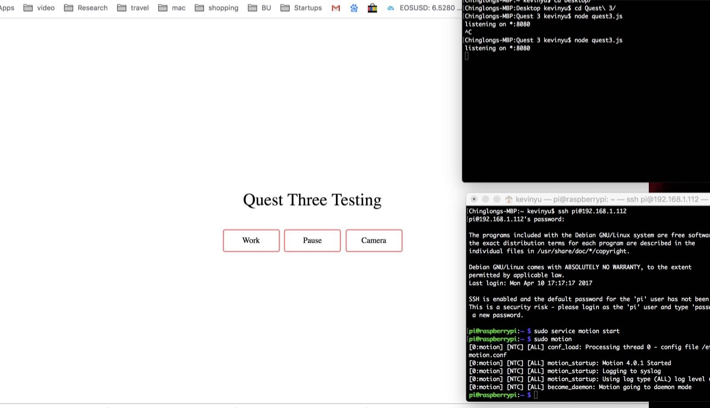
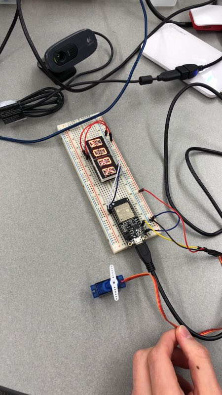

#	Quest 3 Report

Authors: Wuliang Cheng, Qinglang Yu, Cong Han, 2018-10-30

##	Summary

In this quest we built up a system including a camera, a i2c display, a servo, and a remote controlling system that allows us to operate using a website. We figured out
the skills first, such as router setting, http setting or raspery pi and camera setting and then combined them together and tried to work on the javascript to make interface. After this,
we can use website to control the camera, alphanumeric display and servo by directing to the URI link.

##	Evaluation Criteria

-We set up DDNS for our router so that our computer don't have to connect to the router(WiFi) to remotely control our system.

-In our website there are 3 buttons, 'Work', 'Stop', and 'Camera'

-When 'Work' is pressed, the i2c displays 'WORK' and the servo turns to 90 degree

-When 'Stop' is pressed, the i2c display is cleared and the servo returns to the original position

-When 'Camera' is pressed, the browser will be redirected to a new page that shows the camera video(monitoring the servo and i2c display)
	
	
##	Solution Design

Pins mapping:

- Vcc, GND, A0 for servo
- Vcc, GNC, SDA, SCL for Alphanumeric Display

##	Sketches and Photos
1. Website interface.

2. Connection of Alphanumeric display and servo.

##	Modules, Tools, Source Used in Solution
<a href="./Codes">This is a link to the codes we used.</a>
"quest3.c" is the code we used to configure the esp32 board and connecting it to the WiFi(router).
In the "Quest3" folder for our website and remote controlling over our system.

##	Supporting Artifacts

[Here](https://drive.google.com/file/d/1pBVJ155q0-JR2SB7G9dtSMNaRfUTy_Sr/view) is a demo video of our quest. 