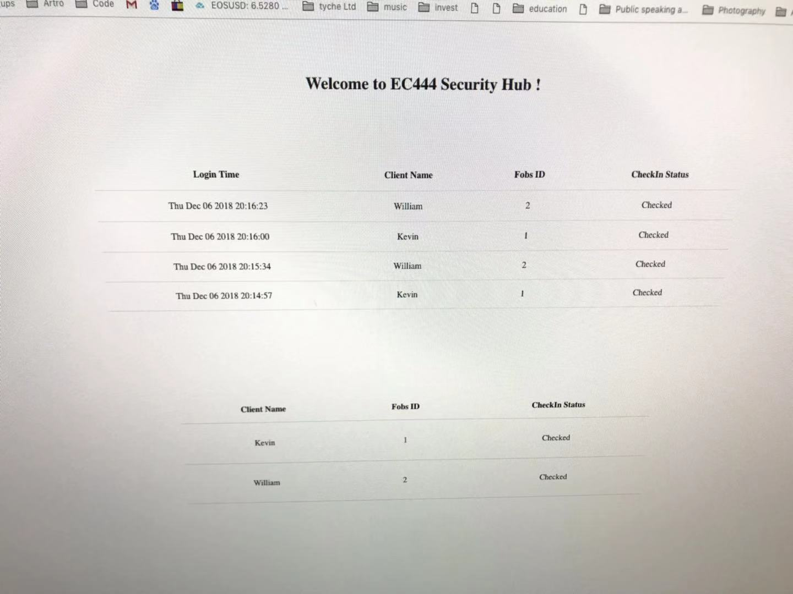
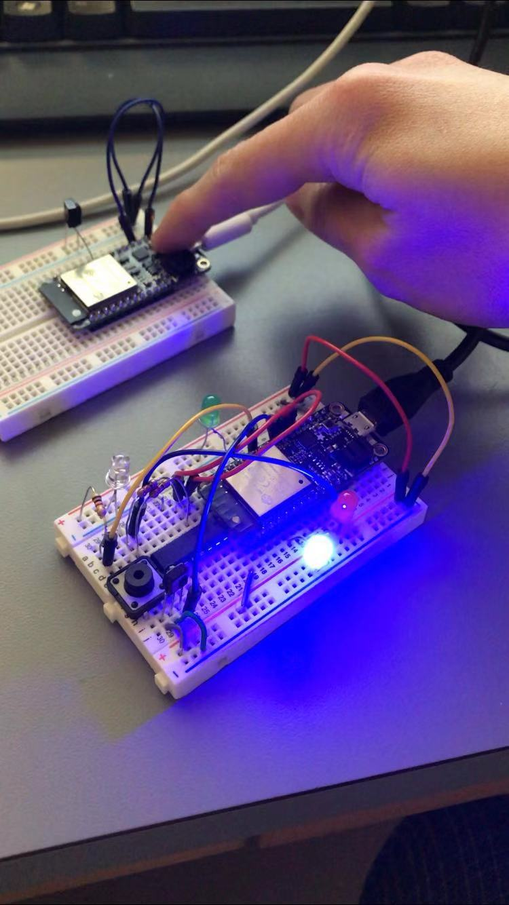
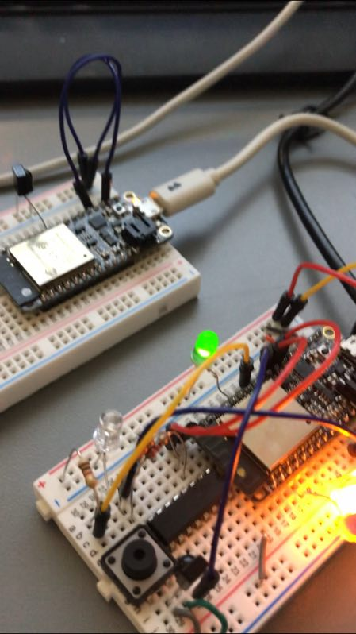

#	Quest 5 Report

Authors: Wuliang Cheng, Qinglang Yu, Cong Han, 2018-12-10

##	Summary

In this quest, we built up a smart security hub which consists of three parts, the smart key fobs, the IR signal receivers, and the Server. We used two ESPs in this quest, one for Smart Key Fobs, where user can switch IDs by pressing the button; the other one is for the IR signal receiver to receive signals from the Fobs and directs that signal message to the Server. We use the Raspberry Pi3 as our Server to host the Web for user Interface. Also, there is a Database in the Pi where all the client's info including name, passcode, and IDs can be found. Finally, on the User Interface, the web can display the client's Login Time, Checkedin Status its ID and the Client's name. All the functionalities can be shown in the Video Demo below. In addition, all the signal is transfered with the UDP Protocol. 

In our Database, we set three clients IDs 01, 02, 03 with Name "Kevin", "William", and "Cong", and with Code "0010", "0100", and "4433". Noticed that each client has its unique code, we deliberately set our three client's code "4030" in the Beacon so that the third could not be able to login to our systems. Only clients with IDs 01 and 02 are able to login. Also in our User Interface, we designed that initially both Client #1 and Client #2 (Kevin and William) are both not checked in. If they checked in with the system, the status in the colume will update to "Checked". Then the web server will send a signal back to the IR receiver to indicate the client info matched with the Database and the Green LED will toggle for 5s indicating the user already checked in. The feedback only gets sent only if the client's info is found in the Database.

Client #1: Name Kevin; ID 01; Code 0010
Client #2: Name William; ID 02; Code 0100
Client #3: Name Cong; ID 03; Code 4030 --> Not be able to check in, not in DB

## Design Vulnerability

After we showed a demo with Prof.Thomas and Emily, we realized that there are still some vulnerability issues with our system design. For instance, the message is sent wirelessly with the UDP Protocol, and someone (hackers) may easily grab the data package from the air and cracked it. Also, since we are using UDP Protocol, sometimes the content of the data package will be lost (not stable).

Improvement we can do:
-Change the connection from wireless to Physical with an Ethernet Cable so as to ensure the data package can be securily transmited without interruptions
-Change the UDP protocol to TCP protocol to prevent data lost issues.

##	Evaluation Criteria

-We set up a Smart Key Fobs station with three IDs to send signals to the IR receiver

-We set up a IR receiver station to receive signals emitted from the Fobs and directs the signals to the Pi Server and receives feedbacks from it.

-We use a raspberry Pi 3 as a host for the Web Server with Database that contains the clients information. The Web server is able to receive msg from the IR receiver and sends feedbacks to it.

-The system as a whole is able to send and receivce msg back and forth with all the smart connected devices and show clients' login status. In particular, the web server will send a signal back to the IR receiver to indicate the client info matched with the Database in the Pi, and the Green LED on the IR receiver will toggle for 5s indicating the user already checked in. The feedback only gets sent only if the client's info is found in the Database.
	
##	Solution Design

Pins mapping:

FOB: 
	
	-three LEDs with different colors
	
	-one green LED that light up for a short period after receiving feedback from the web server
	
	-an IR beacon emitter
	
	-WiFi connection

IR-Receiver: 
	
	-a IR beacon receiver
	
	-WiFi connection

	
##	Sketches and Photos

##	Modules, Tools, Source Used in Solution

<a href="./Codes/quest5_fob.c">This is a link to the codes we used for the FOB.</a>

<a href="./Codes/quest5.c">This is a link to the codes we used for the IR receiver.</a>

<a href="./Codes/index.js">This is a link to the javascript code we used for the user interface.</a>

<a href="./Codes/index.html">This is a link to the html code we used for the user interface.</a>

##	Supporting Artifacts

[Here](https://drive.google.com/file/d/1nX1Mtr8Vh_ay0bcuLk0ElX7XmhMAKdwG/view?usp=sharing) is a demo video of our quest. 