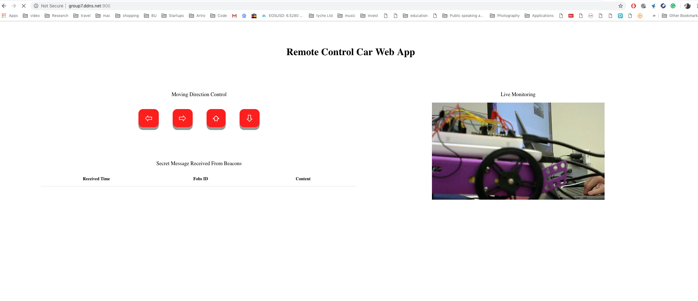
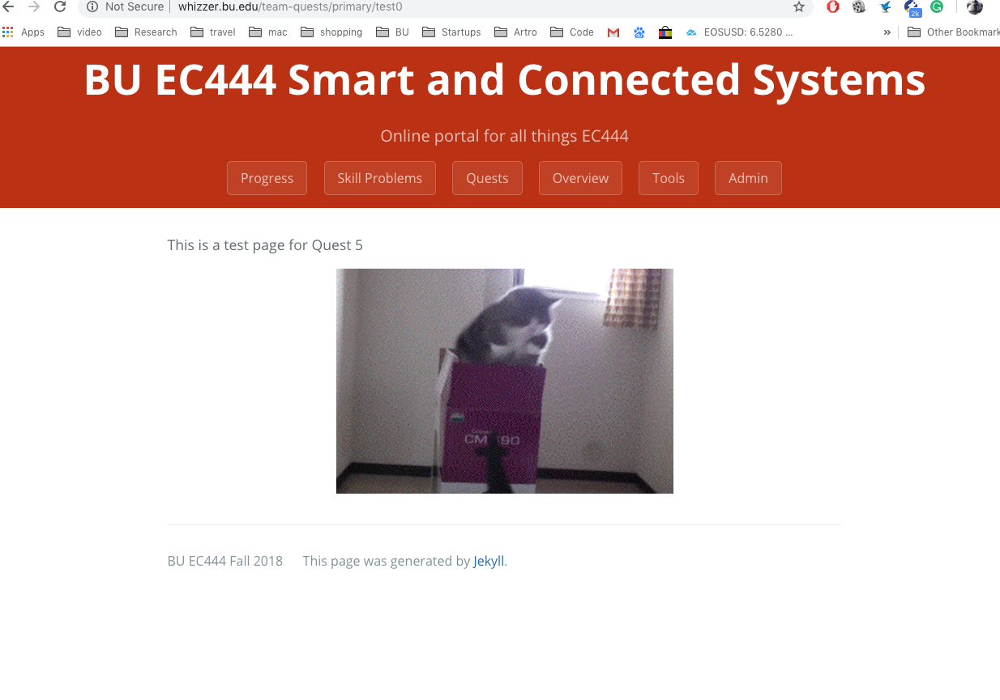
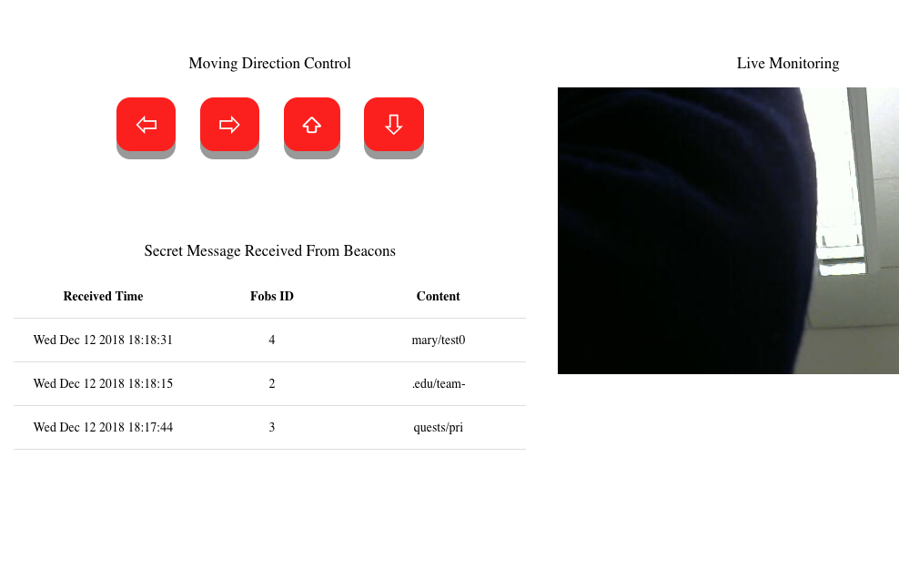
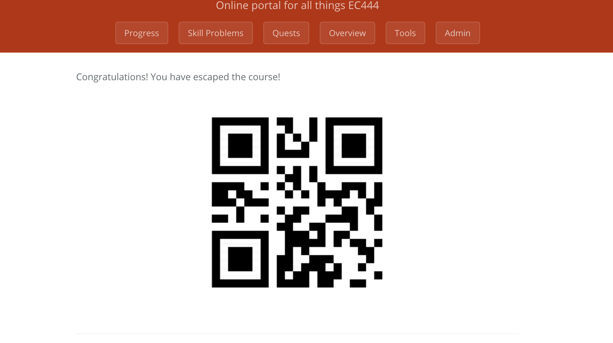

#	Quest 6 Report

Authors: Wuliang Cheng, Qinglang Yu, Cong Han, 2018-12-12

##	Summary

In this quest, we built up a smart remote system which is consisted of three parts: a car with embedded IR receiver, a Raspberry Pi 3 with Web Cam, and finally the HTTP Web server setup. With this system, we are able to remote control the car with the Web App with a live stream window to monitor the car and the environment. There is also an IR sensor embedded on the front of the car to detect the distance between the car and the object in the front. If the car is moving close to an ojbect, with the distance readings by the IR, ESP will stop the motors right away. The task for the quest is to receive msg emitted from the IR station and forward these messages to the web server. We are able to receive all four secret messages from the IR emitter direct to the secret page (whizzer.bu.edu/team-quests/primary/test0). Also once the Web Page is directed to the secret page, the Red LED will start toggling to indicate we successfully escape the classroom. Also, we forward the Web Page with DDNS so that the users can still get the access to controlling the car even not connected to our router.

For our system design, the order of the secret message does not really matter. The way how we design the system is that we create a dictionary in our server file, whenever we receive a message from the server, it will check if that message is in the dictionary and assigned a correspondent ID with it and displayed in the Web Page. In addition, in order to prevent "Duplicated Message", we design an algorithm only store the desired message once and only display it on the Web page once.

For User Interface, there are three sections: the live stream video, the msg content section, and the control command section. For control command section, there are four buttons indicating four different directions, forward, backward, left, and right. For the live stream video, it monitors the real-time live activities of the car and its surroundings. For the msg content section, users can easily check if they receive the secret message from the beacons, and they are able to track the message receiving "TIME", "Fob ID", and "Content".

Secret Message Table:

Beacon	Fragment	Indicator LED
1	whizzer.bu	Red
2	.edu/team-	Blue
3	quests/pri	Green
4	mary/test0	OFF

Control Command: 'l', 'r', 'f', 'b' (send from web server to ESP32)

## Bonus Features and Beyond the Baseline

To indicate we successfully escape from the classroom, not only the web page will be directed to the secret web page, but also the RED LED on the car will keep toggling.
To do this, we design that once the server receives all four fragmented message from the IR, it will send a UDP message ('s') back to the ESP32 on the car, and ESP will decode that message and let the LED keep toggling until a new control command is sent from the web server.

##	Final Demo Artifacts

We have made a demo to the instructors and successfully directed the page to the scret page (http://whizzer.bu.edu/team-quests/primary/escap). On that page, we used the QR Code Scanner on our phones to scan the code on the page, and we saw the message "Happy Holiday!".

##	Evaluation Criteria

-The ESP32 on the car is able to receive the "Control Command" from the webserver, and do the correspondent control on the wheels.

-The IR receiver on the car is able to pick up the message transmitted from the IR Station and forward it to the web server

-The Web Server is able to decode the message sent from the ESP and display it to the Http Client Page

-Users are able to remote control the car by pressing the correspondent buttons to send the control command to ESP32

-The live stream video recorded by the webcam on the Raspberry Pi 3 can monitor the real-time activities of the car on the Web Page.

-Once the Webserver receives all four fragmented secret messages, the web page will be automatically directed to the Secret Page, and the RED LED on the car will start toggling to indicate we successfully escape from the classroom

-The car is able to stop right away if the distance between it and the object in the front is too close. This is done by the IR embedded on the front of the car.
	
##	Solution Design

Pins mapping:

FOB: 
	
	-three LEDs with different colors
	
	-one green LED that light up for a short period after receiving feedback from the web server
	
	-an IR beacon emitter
	
	-WiFi connection

IR-Receiver: 
	
	-a IR beacon receiver
	
	-WiFi connection

WEB-PORT:

    -3000 for Web Socket

    -5000 for ESP UDP Communication

    -8080 for HTTP Server
	
This is a system diagram: 

	
##	Sketches and Photos

These are some pictures of the hardwares and user interface we used

This is a picture of the page we were redirected to in the demo day

Scanning the barcode with our phone, we get

##	Modules, Tools, Source Used in Solution

<a href="./Codes">This is a link to the folder of our codes.</a>

##	Supporting Artifacts

[Demo Video](https://drive.google.com/file/d/1RsANWp7wujtHrTKtbFNKiHXtNzp9B6Dl/view?usp=sharing)

